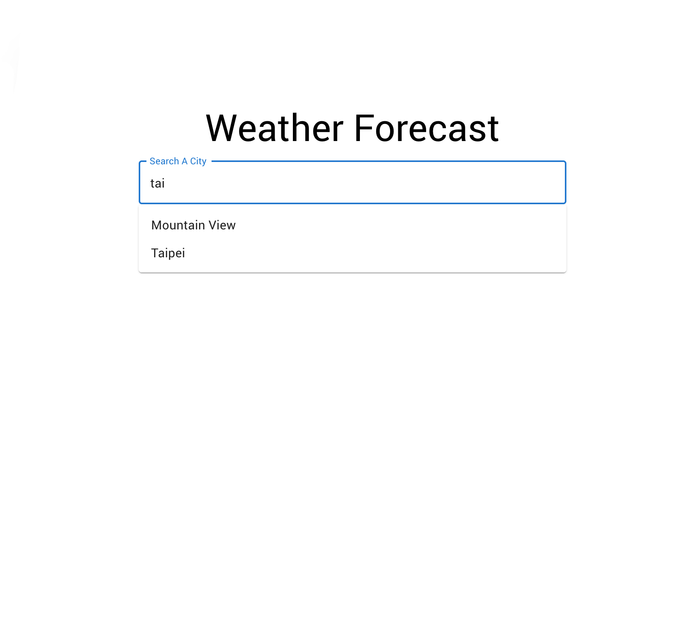
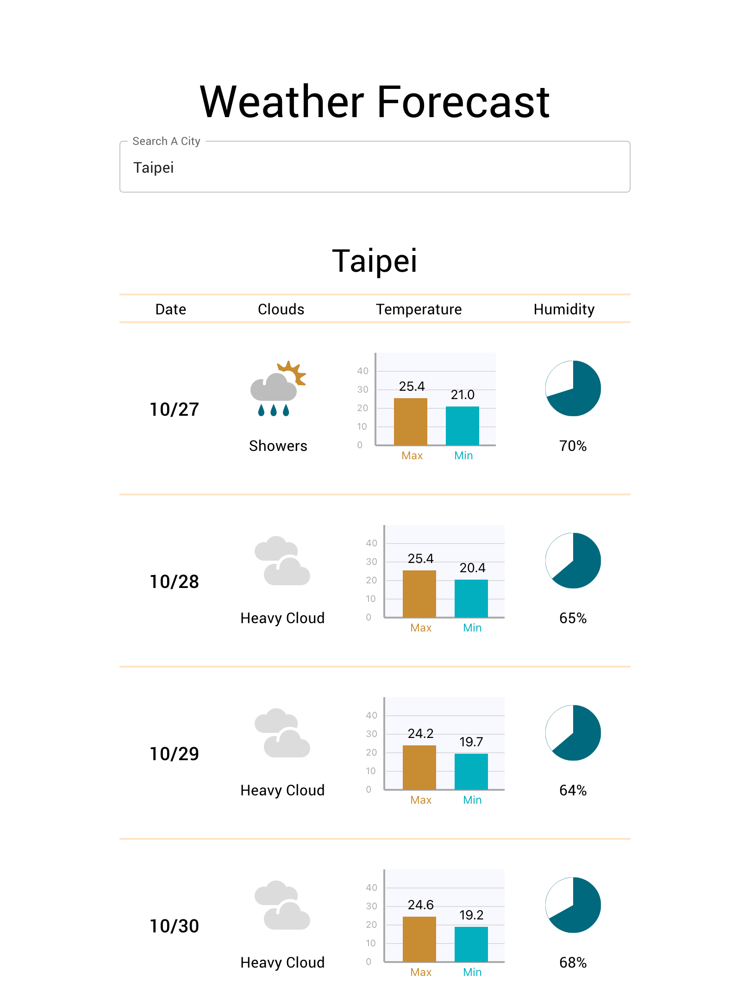

## Available Scripts

In the project directory, first run `yarn install` to install the node_modules,then you can run:

note: Browser extensions to skip CORS problem during developing (ex: Moesif Orign & CORS Changer).

### `yarn start`

Runs the app in the development mode.\
Open [http://localhost:3000](http://localhost:3000) to view it in the browser.

The page will reload if you make edits.\
You will also see any lint errors in the console.

This project was bootstrapped with [Create React App](https://github.com/facebook/create-react-app).
